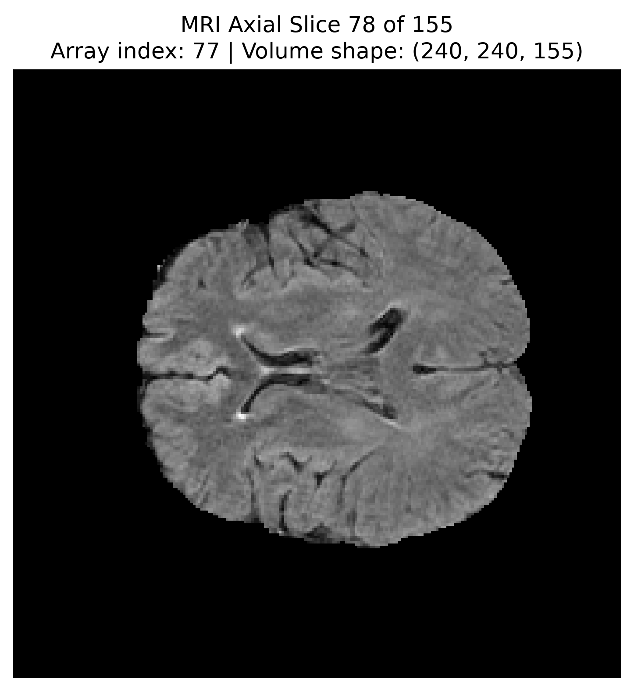
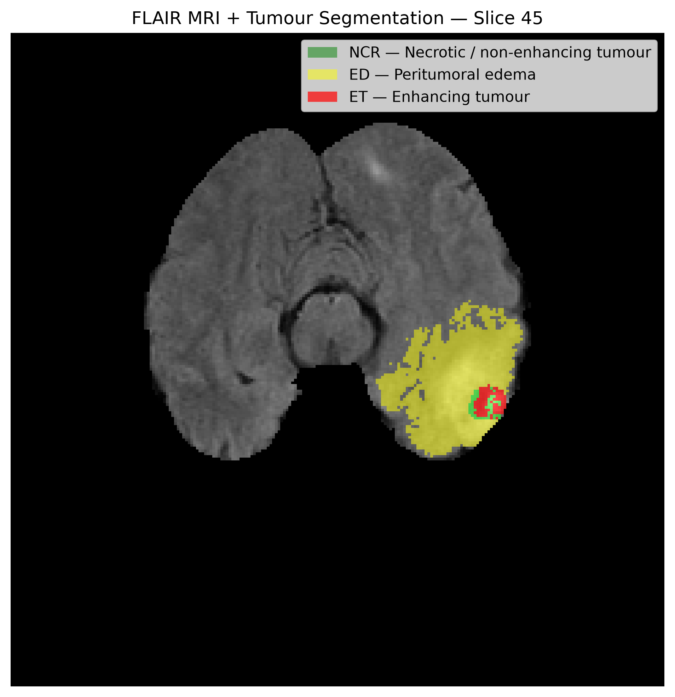
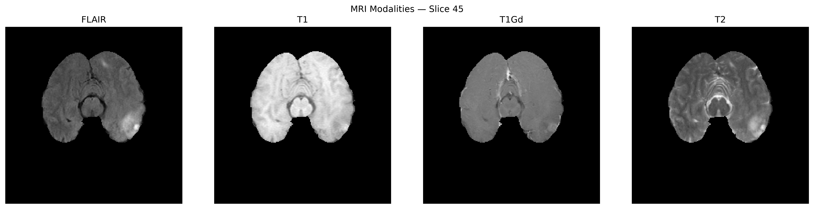
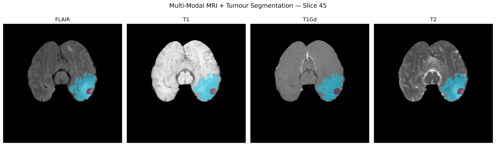

<div align="center">

# 🧠 AI/ML-Powered Multi-Modal MRI Radiomics for Brain Cancer Analysis

### 3D MRI • Radiomics • Tumour Geometry • Intensity Analysis • 3D GLCM

An end-to-end 3D MRI radiomics pipeline for brain tumor analysis using multi-modal pre-operative MRI from TCGA-GBM.

<br>


<br>

**Pilot analysis completed · Full-dataset feature extraction completed**

</div>

---

## 🔬 Project Overview

Brain cancer exhibits substantial variation in tumour morphology, MRI signal characteristics, and spatial heterogeneity.

This project develops an AI/ML-driven MRI radiomics pipeline for quantitative characterization of brain tumours using multi-modal pre-operative MRI, with downstream applications in machine learning and multi-omics integration.

The analysis focuses on four MRI modalities:

- FLAIR
- T1
- T1Gd
- T2

Tumour regions are defined using the manually corrected `GlistrBoost_ManuallyCorrected` segmentation when available.

The workflow is designed to transform multi-modal MRI volumes and tumour segmentations into structured subject-level quantitative features for subsequent statistical analysis, machine learning, and integration with molecular or clinical data.

The overall workflow is:

**Multi-Modal MRI → Tumour Segmentation → Intensity Normalization → Tumour Masking → Geometry Features → Intensity Features → 3D GLCM Texture Features → Subject-Level Radiomics Dataset → Downstream Analysis**

---

## 📊 Dataset

**Dataset:** [TCGA-GBM pre-operative MRI dataset](https://www.cancerimagingarchive.net/analysis-result/brats-tcga-gbm/)

The extracted dataset contains:

**102 TCGA-GBM subjects**

Each subject directory contains multi-modal MRI volumes together with tumour segmentation files.

### MRI Modalities

| Modality | Description |
|---|---|
| FLAIR | Fluid-attenuated inversion recovery MRI |
| T1 | T1-weighted MRI |
| T1Gd | Contrast-enhanced T1-weighted MRI |
| T2 | T2-weighted MRI |

### Segmentation

The pipeline uses:

`*_GlistrBoost_ManuallyCorrected.nii.gz`

as the tumour segmentation source.

The manually corrected segmentation is used to maintain consistency across the processed cohort.

> **Among 102 patient MRIs 97 had manually corrected segmentation**

---

## ⚙️ Radiomics Pipeline

### 01. Data Discovery and Organization

The dataset is organized into subject-specific directories.

For each subject, the pipeline identifies:

- FLAIR MRI
- T1 MRI
- T1Gd MRI
- T2 MRI
- Manually corrected tumour segmentation

The subject identifier is taken directly from the original TCGA directory name.

Examples:

```text
TCGA-02-0006
TCGA-02-0009
TCGA-02-0011
```

This preserves the relationship between extracted radiomics features and the original dataset.

---

### 02. MRI Loading

MRI volumes are loaded from NIfTI files using **NiBabel**.

The voxel data are extracted from each image volume and processed as three-dimensional numerical arrays.

The tumour segmentation is converted into a binary tumour mask:

```python
tumour_mask = mask > 0
```

Only voxels belonging to the tumour are subsequently used for tumour-restricted feature extraction.

---

### 03. Intensity Normalization

MRI signal intensities can vary substantially between scans.

To make the feature-extraction procedure more consistent, each MRI modality is normalized independently.

Only **non-zero image voxels** are used when calculating the normalization percentiles so that the background region does not dominate the intensity distribution.

For each modality:

1. Non-zero image intensities are extracted.
2. The 1st percentile is calculated.
3. The 99th percentile is calculated.
4. Intensities are linearly scaled between these values.
5. The resulting values are clipped to the range 0–1.

The normalization is:

```text
normalized = (image - p1) / (p99 - p1)
```

followed by clipping to:

```text
0 ≤ normalized ≤ 1
```

The normalization is performed independently for:

* FLAIR
* T1
* T1Gd
* T2

---

### 04. Tumour-Restricted Image Analysis

After normalization, the tumour mask is applied to each modality.

Only normalized intensities inside the tumour region are retained for intensity and texture analysis.

Tumour voxel coordinates are also extracted from the binary segmentation for geometric analysis.

---

## 📐 Geometry Features

Ten tumour geometry features are extracted from the segmentation.

### Tumour Volume

The number of tumour voxels is calculated as:

`tumour_volume_voxels`

This provides a voxel-based representation of tumour size.

### Bounding Box

The axis-aligned tumour bounding box is calculated along the three spatial dimensions:

* `bbox_x`
* `bbox_y`
* `bbox_z`

### Tumour Centroid

The centre of the tumour is represented using the mean coordinates of all tumour voxels:

* `centroid_x`
* `centroid_y`
* `centroid_z`

### Surface Area

The tumour surface is reconstructed from the binary segmentation using the marching-cubes algorithm.

Voxel spacing from the NIfTI image header is supplied during surface reconstruction.

The resulting feature is:

`surface_area_mm2`

### Sphericity

Tumour sphericity describes how closely the tumour shape approaches a sphere.

It is calculated from tumour volume and surface area:

```text
Sphericity =
π^(1/3) × (6V)^(2/3) / A
```

where:

* `V` = tumour volume
* `A` = tumour surface area

### Elongation

Tumour shape anisotropy is estimated using Principal Component Analysis (PCA) on the three-dimensional tumour coordinates.

The feature is calculated from the ratio between the largest and second-largest principal spatial spreads:

```text
Elongation =
largest principal spread /
second-largest principal spread
```

---

## 🧪 Intensity Features

Three tumour intensity features are extracted independently for each MRI modality:

* Mean
* Standard deviation
* Coefficient of variation

This produces:

**4 modalities × 3 intensity features = 12 features**

### FLAIR

* `FLAIR_mean`
* `FLAIR_std`
* `FLAIR_cv`

### T1

* `T1_mean`
* `T1_std`
* `T1_cv`

### T1Gd

* `T1Gd_mean`
* `T1Gd_std`
* `T1Gd_cv`

### T2

* `T2_mean`
* `T2_std`
* `T2_cv`

### Coefficient of Variation

The coefficient of variation is calculated as:

```text
CV = standard deviation / mean
```

It provides a measure of relative intensity variability within the tumour.

---

## 🧬 3D GLCM Texture Analysis

Texture analysis is performed using a custom **3D Gray-Level Co-occurrence Matrix (GLCM)** implementation.

Unlike a single-slice 2D approach, the implementation operates across the three spatial dimensions of the tumour volume.

### Quantization

Normalized tumour intensities are quantized into:

**8 gray levels**

The resulting intensity levels range from:

```text
0–7
```

### Spatial Directions

Neighbouring voxel pairs are evaluated along three principal directions:

```text
(1, 0, 0)
(0, 1, 0)
(0, 0, 1)
```

Only voxel pairs where both voxels belong to the tumour mask are included.

The resulting GLCM is then:

1. Symmetrized
2. Normalized so that the matrix sums to 1

---

### 📊 GLCM Features

Four texture features are calculated for each MRI modality:

* Contrast
* Homogeneity
* Energy
* Correlation

This produces:

**4 modalities × 4 texture features = 16 features**

### FLAIR

* `FLAIR_glcm_contrast`
* `FLAIR_glcm_homogeneity`
* `FLAIR_glcm_energy`
* `FLAIR_glcm_correlation`

### T1

* `T1_glcm_contrast`
* `T1_glcm_homogeneity`
* `T1_glcm_energy`
* `T1_glcm_correlation`

### T1Gd

* `T1Gd_glcm_contrast`
* `T1Gd_glcm_homogeneity`
* `T1Gd_glcm_energy`
* `T1Gd_glcm_correlation`

### T2

* `T2_glcm_contrast`
* `T2_glcm_homogeneity`
* `T2_glcm_energy`
* `T2_glcm_correlation`

---

### 🔹 GLCM Feature Definitions

### Contrast

Measures the degree of local gray-level difference between neighbouring voxels.

### Homogeneity

Measures how strongly the gray-level co-occurrence distribution is concentrated near the diagonal.

### Energy

Measures the concentration of the gray-level pair distribution.

It is calculated as:

```text
Energy = sqrt(sum(GLCM²))
```

### Correlation

Measures the statistical relationship between the gray levels of neighbouring voxels.

---

## 🧪 Pilot Analysis

The radiomics workflow was first developed and validated using a single pilot subject.

**Pilot subject:**

`TCGA-02-0006`

The pilot analysis established and checked:

✅ MRI loading  
✅ Tumour segmentation loading  
✅ Tumour mask generation  
✅ Non-zero percentile intensity normalization  
✅ Tumour-restricted intensity extraction  
✅ Tumour geometry calculations  
✅ Surface reconstruction  
✅ Sphericity calculation  
✅ PCA-based elongation  
✅ 3D intensity quantization  
✅ Custom 3D GLCM construction  
✅ GLCM texture-feature extraction  
✅ Final 38-feature table  

For the pilot subject, the tumour contained:

**38,314 tumour voxels**

The resulting geometry included:

* Bounding box: `58 × 59 × 48`
* Centroid approximately:

  * X = `162.35`
  * Y = `110.38`
  * Z = `48.61`
* Surface area ≈ `14,430.06 mm²`
* Sphericity ≈ `0.380879`
* Elongation ≈ `1.150538`

The pilot was used as the reference workflow before applying the pipeline to the complete dataset.

> **Important:** The pilot serves as a method-development and validation stage for the feature-extraction workflow. It is not treated as an independent biological or machine-learning validation result.

### 📁 Pilot Visualization Files

The pilot visualizations generated during the analysis are saved locally in:

`figures/pilot/`

The saved figures include:

- `all_modalities_segmentation_slice45.png` — FLAIR, T1, T1Gd and T2 with tumour segmentation overlay
- `flair_tumour_segmentation_slice45.png` — FLAIR with tumour segmentation
- `mri_modalities_slice45.png` — Four MRI modalities shown side-by-side
- `mri_axial_middle_slice78.png` — MRI axial slice of the middle section

These figures are retained as part of the pilot analysis and are also included in the GitHub repository for visualization and documentation.

<table>
<tr>
<td align="center">
<strong>MRI Axial Middle Slice</strong><br><br>

</td>
<td align="center">
<strong>FLAIR + Tumour Segmentation</strong><br><br>

</td>
</tr>

<tr>
<td colspan="2" align="center">
<strong>MRI Modalities</strong><br><br>

</td>
</tr>

<tr>
<td colspan="2" align="center">
<strong>All Modalities + Tumour Segmentation</strong><br><br>

</td>
</tr>
</table>

---

## 🚀 All-Subject Feature Extraction

The validated pilot workflow was automated and applied to all identified TCGA-GBM subject directories.

### Automated Workflow

For each subject, the pipeline performs:

* MRI file identification
* NIfTI loading
* Tumour mask generation
* Non-zero percentile normalization
* Tumour-restricted intensity extraction
* Tumour coordinate extraction
* Geometry feature extraction
* Surface-area calculation
* Sphericity calculation
* PCA-based elongation calculation
* 8-level intensity quantization
* 3D GLCM construction
* GLCM feature calculation
* Construction of the final 38-feature vector
* Subject-specific CSV output

---

## 📊 Processing Results

A total of:

**102 subjects**

were identified.

The automated pipeline successfully processed:

**97 subjects**

Five subjects were excluded because the required manually corrected tumour segmentation was unavailable.

### Excluded Subjects

| Subject | Reason |
|---|---|
| `TCGA-02-0070` | Manually corrected segmentation unavailable |
| `TCGA-06-0238` | Manually corrected segmentation unavailable |
| `TCGA-08-0509` | Manually corrected segmentation unavailable |
| `TCGA-08-0520` | Manually corrected segmentation unavailable |
| `TCGA-12-3650` | Manually corrected segmentation unavailable |

These subjects contained `GlistrBoost` segmentations but did not contain the corresponding:

`GlistrBoost_ManuallyCorrected`

file.

The pipeline did not automatically substitute the uncorrected segmentation in order to maintain consistency with the validated feature-extraction workflow.

---

## 📁 Subject-Level Feature Files

Each successfully processed subject is saved as an individual CSV file.

The original TCGA identifier is used directly in the filename.

Examples:

```text
TCGA-02-0006_features.csv
TCGA-02-0009_features.csv
TCGA-02-0011_features.csv
```

The subject-level files are stored locally in:

```text
data/features/per_subject/
```

Each CSV contains:

**1 subject × 38 radiomics features**

---

## 📊 Master Radiomics Dataset

The individual subject-level feature tables are combined into a single master dataset.

The final master table contains:

**97 subjects × 39 columns**

consisting of:

* `subject_id`
* 38 radiomics features

The 38 radiomics features consist of:

```text
10 Geometry
+
12 Intensity
+
16 3D GLCM Texture
=
38 Features
```

The master table is saved locally as:

```text
data/features/tcga_gbm_radiomics_features.csv
```

This table serves as the main imaging-feature matrix for subsequent analysis.

---

## 🧾 Feature Schema

### Geometry — 10 Features

```text
tumour_volume_voxels
bbox_x
bbox_y
bbox_z
centroid_x
centroid_y
centroid_z
surface_area_mm2
sphericity
elongation
```

### Intensity — 12 Features

```text
FLAIR_mean
FLAIR_std
FLAIR_cv

T1_mean
T1_std
T1_cv

T1Gd_mean
T1Gd_std
T1Gd_cv

T2_mean
T2_std
T2_cv
```

### Texture — 16 Features

```text
FLAIR_glcm_contrast
FLAIR_glcm_homogeneity
FLAIR_glcm_energy
FLAIR_glcm_correlation

T1_glcm_contrast
T1_glcm_homogeneity
T1_glcm_energy
T1_glcm_correlation

T1Gd_glcm_contrast
T1Gd_glcm_homogeneity
T1Gd_glcm_energy
T1Gd_glcm_correlation

T2_glcm_contrast
T2_glcm_homogeneity
T2_glcm_energy
T2_glcm_correlation
```

---

## 🔍 Quality Control

Several quality-control checks were performed after feature extraction.

### Dataset Structure

```text
Total subjects identified: 102
Successfully processed: 97
Excluded: 5
```

### Master Table

```text
Rows: 97
Columns: 39
Unique subjects: 97
Duplicate subjects: 0
Missing values: 0
```

### Feature Consistency

The final automated feature table was compared against the validated pilot feature schema.

The result was:

```text
Same columns: True
Missing columns: None
Extra columns: None
```

Therefore, the automated pipeline reproduces the same **38-feature schema** established during the pilot analysis.

### Numerical Quality Control

The feature matrix was checked for:

* Non-numeric values
* Missing values
* Infinite values
* Duplicate feature columns
* Invalid sphericity values
* Invalid elongation values
* Invalid normalized intensity ranges
* Invalid GLCM feature ranges

No detected violations were found in these checks.

---

## 📈 Feature Distribution

Summary statistics were calculated across the 97 successfully processed subjects.

The feature-distribution analysis includes:

* Count
* Mean
* Standard deviation
* Minimum
* 25th percentile
* Median
* 75th percentile
* Maximum

This provides an initial overview of the variability of tumour morphology, MRI intensity, and texture across the processed cohort.

---

## 💾 Data and Reproducibility

The large MRI dataset is intentionally **excluded from Git tracking**.

The repository contains the analysis notebooks and project structure, while the raw MRI data and locally generated feature tables remain outside version control.

The current project workflow is designed so that the radiomics feature dataset can be regenerated from the original local imaging dataset using the analysis notebooks.

---

## 🔮 Future Analysis

The radiomics dataset generated by this notebook provides the imaging layer for subsequent stages of the project.

Planned downstream analyses may include:

* Exploratory radiomics statistics
* Feature correlation analysis
* Feature redundancy assessment
* Feature selection
* Dimensionality reduction
* Machine-learning analysis
* Clinical-variable integration
* TCGA molecular-data integration
* Radiogenomic analysis
* Biological interpretation
* Pathway-level analysis
* Independent or external validation where appropriate

These stages are separate from the feature-extraction workflow documented in this repository.

---

## 🧬 Scientific Direction

The broader goal of the project is to investigate whether quantitative MRI-derived tumour characteristics can be connected with molecular and biological properties of brain tumours.

The current radiomics matrix provides three complementary imaging perspectives:

**Tumour morphology**

→ geometry and shape

**Tumour signal characteristics**

→ normalized intensity statistics

**Tumour spatial heterogeneity**

→ 3D texture features

Together, these form a structured imaging representation that can subsequently be integrated with other biological layers.

---

## 🛠️ Technology Stack

| Tool | Purpose |
|---|---|
| **Python** | Core programming language |
| **Jupyter Notebook** | Interactive analysis |
| **NiBabel** | NIfTI MRI loading |
| **NumPy** | Numerical computation |
| **Pandas** | Feature-table handling |
| **scikit-image** | Marching cubes and image analysis |
| **Scikit-learn** | PCA and Machine-learning analysis |
| **Matplotlib** | Visualization |
| **Git / GitHub** | Version control and reproducibility |

---

## 📚 References

* TCGA-GBM imaging dataset: [TCGA-GBM](https://www.cancerimagingarchive.net/analysis-result/brats-tcga-gbm/)
* NiBabel documentation: [https://nipy.org/nibabel/](https://nipy.org/nibabel/)
* scikit-image documentation: [https://scikit-image.org/](https://scikit-image.org/)
* scikit-learn documentation: [https://scikit-learn.org/](https://scikit-learn.org/)
* NumPy documentation: [https://numpy.org/](https://numpy.org/)
* Pandas documentation: [https://pandas.pydata.org/](https://pandas.pydata.org/)

---

## 📁 Repository Structure

```text
neuro-onco-omics/
│
├── data/                                               # Local MRI dataset & radiomics features (Git ignored)
│
├── figures/
│   └── pilot/
│       ├── all_modalities_segmentation_slice45.png
│       ├── flair_tumour_segmentation_slice45.png
│       ├── mri_axial_middle_slice78.png
│       └── mri_modalities_slice45.png                  
│
├── notebooks/
│   ├── 01_pilot_analysis.ipynb                         # Pilot MRI radiomics workflow
│   └── 02_all_subjects_features.ipynb                  # Automated feature extraction
│
├── src/                                                # Source code and reusable functions
│
├── .gitignore
│
└── README.md
```